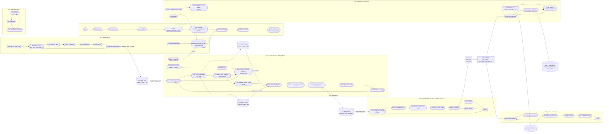

```mermaid
flowchart LR
  %% Global shared objects
  FATAL_FLAG[(program_fatal_error_flag\nEventFlags bit0)]
  IMU_MB[(imu_mail_box\nMail imu_data_t x10)]
  MIRROR_A[(accel mirror buffers\n3 axes, window 256)]
  MIRROR_G[(gyro mirror buffers\n3 axes, window 256)]
  FFT_BUFS[(fft_results ring\n2 buffers, each has Mutex)]
  FILTERS[(bool filters\nthreshold 2)]
  STATUS_GETTERS[[status getters\nget_tremor / get_dyskinesia / get_fog]]
  BLE_CONN[(device_connected flag)]
  BLE_CHAR[(GATT status string\nTREMOR DYSKINESIA FOG NONE)]

  %% MAIN / Supervisor
  subgraph MAIN["Main thread supervisor"]
    M0([Boot])
    M1([Init LED BSP])
    M2([Init Serial BSP])
    M3([Init IMU BSP])
    M4([Create program_fatal_error_flag])
    M5([Start threads\nIMU FFT Analysis LED BLE Test])
    M6([Wait fatal flag bit0])
    M7([Terminate all tasks])
    M8([Fatal handler loop\nblink + LOG_FATAL])
    M0-->M1-->M2-->M3-->M4-->M5-->M6-->M7-->M8
  end
  FATAL_FLAG --> M6

  %% IMU TASK
  subgraph IMU["imu_task producer"]
    I0([Allocate imu_mail_box])
    I1([Wait data ready\nimu_data_wait 1000ms])
    I2([try_alloc imu_data_t])
    I3([Read accel 3])
    I4([Read gyro 3])
    I5([Stamp timestamp])
    I6([Put pointer into mailbox])
    I0-->I1-->I2-->I5-->I3-->I4-->I6-->I1
    I_TO([Timeout or alloc fail]) --> FATAL_FLAG
  end
  I6 -->|put imu_data_t pointer| IMU_MB

  %% FFT TASK
  subgraph FFT["fft_task consumer and DSP producer"]
    F0([Create mirror buffers\naccel 3 + gyro 3])
    F1([Init RFFT N 256])
    F2([Prime window with 256 samples\nblocking get])
    F3([Get from imu_mail_box])
    F4([Push into mirror buffers\nper axis])
    F5([Free imu_data_t back to mailbox pool])
    F6([While mailbox not empty])
    F7([Lock oldest fft_results buffer\ntrylock])
    F8([Copy window to fft_input])
    F9([RFFT -> magnitude -> PSD -> scale])
    F10([Write fft_results and timestamp])
    F11([Unlock fft_results buffer])
    F0-->F1-->F2-->F3-->F4-->F5-->F2
    F6-->F3
    F5-->F7-->F8-->F9-->F10-->F11-->F6
    F_FAIL([Buffer create fail]) --> FATAL_FLAG
  end
  IMU_MB -->|try_get or try_get_for| F3
  F4 --> MIRROR_A
  F4 --> MIRROR_G
  MIRROR_A -->|get_window pointer| F8
  MIRROR_G -->|get_window pointer| F8
  F10 -->|write under mutex| FFT_BUFS

  %% ANALYSIS TASK
  subgraph ANA["analysis_task DSP consumer and state producer"]
    A0([Init bool filters])
    A1([Loop])
    A2([Lock latest fft_results buffer\ntrylock])
    A3([Read gyro PSD 3 axes])
    A4([Detect tremor dyskinesia FOG])
    A5([Unlock fft_results buffer])
    A6([Update bool filters])
    A7([Sleep 100ms])
    A0-->A1-->A2-->A3-->A4-->A5-->A6-->A7-->A1
  end
  FFT_BUFS -->|read under mutex| A2
  A6 --> FILTERS
  FILTERS --> STATUS_GETTERS

  %% LED TASK
  subgraph LED["led_task UI consumer"]
    L0([Loop])
    L1([Read status getters])
    L2([Set blue yellow pattern])
    L3([Read ble_is_connected])
    L4([Set green LED2])
    L5([Green LED1 breathing])
    L0-->L1-->L2-->L3-->L4-->L5-->L0
  end
  STATUS_GETTERS --> L1
  BLE_CONN --> L3

  %% BLE TASK
  subgraph BLE["ble_task comms consumer"]
    B0([Init BLE and register GATT])
    B1([Advertising and event queue\nforever])
    B2([On connect set device_connected true])
    B3([Ticker every 1s\nschedule notification])
    B4([Read status getters])
    B5([Write string to GATT char])
    B0-->B1
    B2-->B3-->B4-->B5-->B3
    B_FAIL([BLE init fail]) --> FATAL_FLAG
  end
  STATUS_GETTERS --> B4
  B2 --> BLE_CONN
  B5 --> BLE_CHAR

  %% TEST TASK
  subgraph TEST["test_task diagnostics"]
    T0([Loop every 2s])
    T1([Thread stats])
    T2([CPU usage from idle delta])
    T0-->T1-->T2-->T0
  end

  %% Fatal error signals
  IMU -.set bit0.-> FATAL_FLAG
  FFT -.set bit0.-> FATAL_FLAG
  BLE -.set bit0.-> FATAL_FLAG
```
